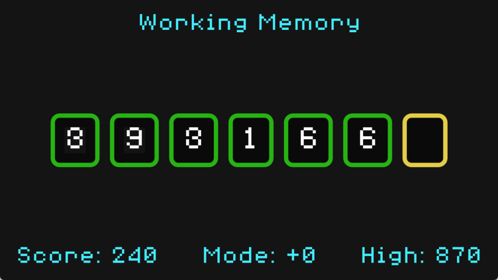

# Working Memory

Test your working memory in three rounds.
Later rounds are worth more points.

Play it online at: [https://bblodget.itch.io/working-memory](https://bblodget.itch.io/working-memory)

This game was written for the 
[OLC CodeJam 2023](https://itch.io/jam/olc-codejam-2023).  
The theme for this CodeJam is Memory.

This game was inspired by the book
**Thinking, Fast and Slow** by Daniel Kahneman

Game Font: [8 Bit Operator Font](https://www.wfonts.com/font/8-bit-operator)
(License: SIL OPEN FONT LICENSE Version 1.1)

Game Engine: Godot 4.1
